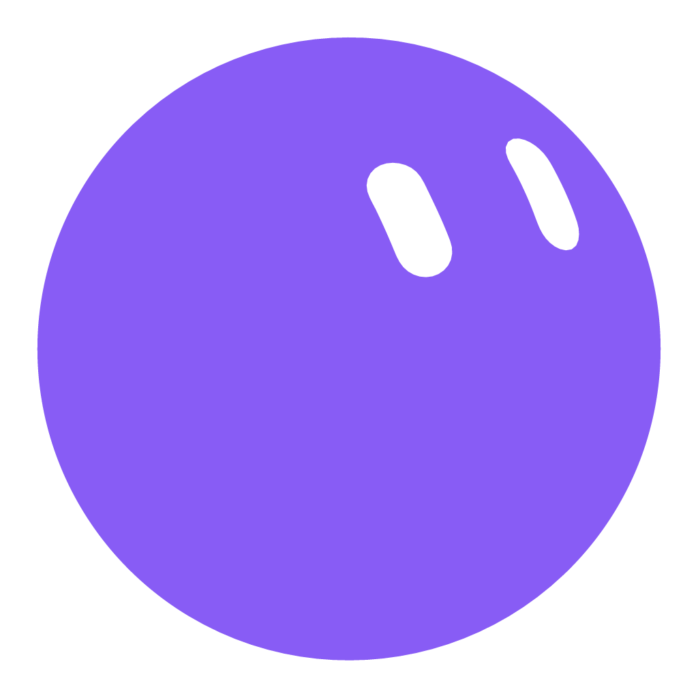
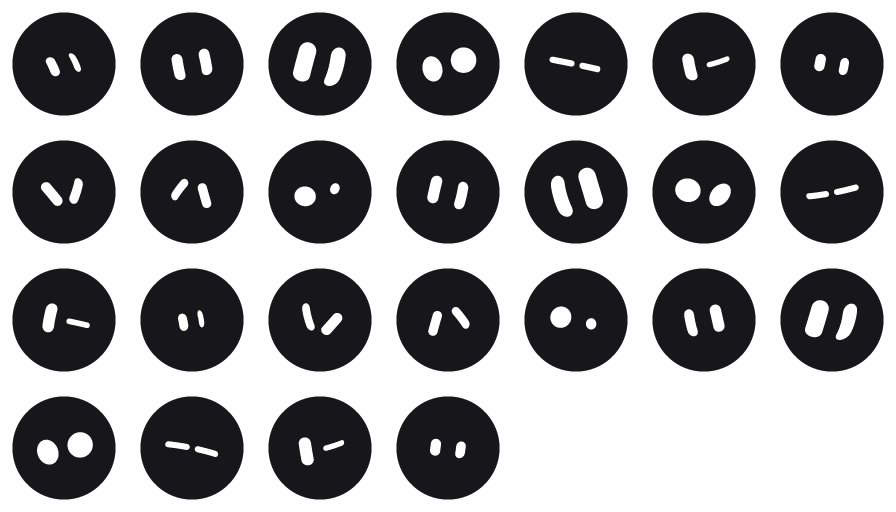

# EMoO BOT

A desktop mascot in the Grok Bot style — a solid vector blob with two expressive
eyes, no mouth, no outline.

It **floats** above your desktop and pays attention to what you are doing. It
drifts near whatever you are pointing at, keeps clear of your cursor, gets out of
the way when you swipe at it, **sits on the title bar of the window you are
working in and rides along when you move it**, follows you to your other monitor,
and reacts when you switch apps. Poke it, tickle it, pet it, or grab it out of
the air and throw it.

It also **remembers you** between launches — how fond of you it is, how many days
you have known each other, how many times you have thrown it — and it will
wait on a spot you choose while you work, count how long you have been heads-down
in one app, and hold your timers.



---

## Install

**Windows 10 / 11.** Download the latest build from the
[Releases page](https://github.com/SHAMMA6/qu-bot-desktop/releases/latest):

| File | What it is |
| --- | --- |
| `EMoO-BOT-<version>-Setup.exe` | Installer — Start-menu and desktop shortcuts, and a normal uninstall entry |
| `EMoO-BOT-<version>-portable.exe` | One file, no install. Double-click it and the bot appears |

Nothing else is needed — Node and Electron are bundled inside.

**macOS and Linux** builds (`.dmg`, `.AppImage`) are produced by the same CI run
and attached to each release. Everything works there except *Notice the app in
front*, which relies on a Windows-only helper and simply stays off.

The builds are not code-signed, so the first launch shows SmartScreen's
*"Windows protected your PC"*. Click **More info → Run anyway**. Silencing that
permanently needs a paid code-signing certificate.

Once running it lives in the system tray — right-click the tray icon for
settings, or press `Ctrl` + `Alt` + `B` to summon it to your cursor.

**It starts with Windows.** That is on out of the box: a desk companion that is
only there on the days you remember to launch it is not much of a companion. It
says so once, the first time, and the switch is **Settings → Behaviour → Start
with Windows** whenever you want it off.

> **Upgrading from QU Bot?** Same app, new name. The installer replaces the old
> one in place, and your settings, your spot and everything the bot remembers
> about you are carried across on first run.

## Running from source

Needs [Node.js](https://nodejs.org) 20 or newer.

```bash
git clone https://github.com/SHAMMA6/qu-bot-desktop.git
cd qu-bot-desktop
npm install
npm start
```

Build your own installer and portable build into `dist/`:

```bash
npm run build
```

## What it does

**78 emotions**, each a complete performance rather than just a face — its own eye
geometry, breathing rate, posture, lean, blink rhythm, eyelid droop, gaze
behaviour, jitter and particle effect.

| Group | Emotions |
| --- | --- |
| Everyday | idle, neutral, happy, content, listening, talking, cosy, zen |
| Delighted | excited, smitten, laughing, celebrating, proud, smug, wink, shy, grateful, hopeful, starstruck, triumphant, cheering, relieved, playful, up to something |
| Attentive | curious, confused, thinking, focused, working, alert, reading, typing along, searching, determined, suspicious, daydreaming |
| Startled | surprised, shocked, scared, dizzy, amazed, impressed, wrong way |
| Low | sad, pleading, bored, sleepy, asleep, where did you go, sulking, sorry, yawning |
| Spiky | annoyed, angry, skeptical, glitched, not having it, told you, nervous, embarrassed, glitching |
| Doing something | grooving, humming, stretching, waving, taking a picture |
| The room | chilly, overheated, peckish |
| Glances | look left / right / up / down, peeking |
| Physical | held, falling, squished, walking |



*Eye geometry only — the posture, eyelid droop, motion and effects that carry
most of each emotion do not survive a still frame. Every pair is centred on the
head: an expression carries the shape of the eyes, never their position, because
position is what gaze is for.*

**You do not pick them.** There is no feelings menu and no action buttons — what
it feels is its own business, reached by weight from mood, energy, boredom,
affection and personality, and from what you are actually doing. That is the
whole point of a companion rather than a toy: you cannot press "be happy".

**It gets on with something while you type.** Typing is most of what anyone does
at a desk, so it is the state worth filling. Rather than one reaction at the
start of a burst and then twenty seconds of nothing, it runs a rolling little
performance for as long as your hands are on the keys — keeping time, reading
over your shoulder, humming, stretching, drifting off — settling into longer
gaps the longer the stretch goes on.

**5 body shapes** — circle, wedge, square, hex and cloud. Each carries its own
face-fitting transform, so the eyes sit correctly on a narrow wedge and a wide
cloud alike, and so does everything it is wearing.

**11 coats** plus any custom colour. The eye colour is derived from the coat's
luminance, so a custom colour never produces unreadable eyes.

**English and Arabic**, covering the menus, the settings window and everything
it says — 319 interface strings and 73 buckets of dialogue in each, with the
settings window laid out right-to-left in Arabic. *Automatic* follows your
system locale. A missing string, or a translated line that drops one of its
placeholders, fails **npm test** rather than showing up in front of a reader.

## It remembers you

Four slow meters — energy, mood, boredom and affection — plus a set of lifetime
counters are written to disk and read back on every launch. The mascot that
greets you tomorrow is the one you had today, with the same opinion of you.

| It tracks | Which shows up as |
| --- | --- |
| Days known, days seen, times opened | `day 41.` — and it means it |
| Time together | Lines that only exist after tens of hours |
| Pokes, pets, tickles, throws | `i have been thrown 200 times and i keep coming back.` |
| Affection, mood | Whether it greets you warmly or tolerates you |

Those add up to a **bond level**, 0 to 4, deliberately slow — level 4 is weeks of
real use. Each level unlocks lines the level below never says, and they are rate
limited to at most one every 25 minutes so they stay a surprise rather than a
catchphrase. The whole record is visible under **Settings → Bond**, and
*Restore all defaults* deliberately leaves it alone; there is a separate,
explicit button to make it forget you.

## Working alongside you

**Give it a spot.** Point at where you want it and press `Ctrl` + `Alt` + `P`.
That is the whole interaction — no dragging it into place first. There are also
four corner presets under **Settings → Focus** and in *Its spot → Park it in a
corner*, and the old "park it where it is now" if you would rather position it by
hand. Wherever you pick, that is where it waits while you type instead of
drifting around your cursor.

**Focus mode** (`Ctrl` + `Alt` + `F`) sends it to that spot and makes it stop
performing entirely — no chatter, no wandering, no idle flourishes. The meters
keep running underneath; it is just being polite.

**It docks into your window.** A second or two after you stop moving the mouse —
or as soon as you start typing — it settles into the title bar of whatever window
is in front, immediately left of the minimise / maximise / close buttons, so it
reads as one more tab on that window. Any window: your browser, a file explorer,
a terminal. Grab that window by its bar and drag it, and the bot comes with it;
it deliberately does *not* back away from your pointer while riding, because your
pointer is on the bar exactly when you are dragging. It never overlaps the
buttons, which is checked by a test, because covering Close would be a genuinely
unpleasant thing to get wrong. A window too narrow to dock into keeps it on the
window rather than pushing it off the edge. This works whether or not *Follow the
cursor* is on; if you have set a home spot, that wins, because it is the more
specific instruction. Turn it off with *Sit on the window you are using*.

**It counts the time you are actually working.** Not wall-clock time — the
clock only advances while the OS reports recent input, so leaving the editor open
while you make coffee does not count. Ask it any time with `Ctrl` + `Alt` + `L`,
and it will volunteer at the 30, 60, 90, 120, 180 and 240 minute marks. It also
notices you bouncing between the same two windows six times in ninety seconds,
and that it is three in the morning.

**Timers, alarms and pomodoro.** Set them from the tray, the right-click menu or
**Settings → Focus**. They persist across restarts — a 45-minute timer survives a
reboot — and an alarm that is overdue by more than five minutes is dropped rather
than fired at you hours late. The pomodoro alternates work and break blocks, and
it performs them: heads-down and quiet during work, confetti when the break
starts.

**Drop a file on it** and it holds onto it. The right-click menu grows a
*Holding n files* section to open them, show them in the folder, or let go. It
holds six at most, and remembers them across restarts.

## Making it yours

**Name it.** Settings → Look. It uses the name in menus and speech.

**Three personality sliders** scale the weights the brain already uses, so two
people's bots genuinely behave differently rather than picking from a
preset list:

| Slider | What actually changes |
| --- | --- |
| Quiet ↔ Chatty | How often it acts at all, and how much of that is speech |
| Independent ↔ Clingy | Whether it wanders off or stays near what you are doing |
| Sweet ↔ Sassy | Picks a spikier variant of a line where one exists |

**Grab weight** decides how tightly it follows your cursor when you pick it up.
See [How it feels in the hand](#how-it-feels-in-the-hand).

**Sound** is synthesised at runtime — there are no audio files in the build.
Each emotion group has its own timbre, a landing thumps lower and dirtier the
harder it lands, a throw whistles, and it breathes while it sleeps.

**Pick what it wears** under **Settings → Look → Wearing**, or from
*right-click → Wearing*:

| Group | |
| --- | --- |
| Automatic | Follows the calendar — santa hat in December, sunglasses in July, witch hat at Halloween, party hat on New Year. The settings panel tells you what that means today |
| Nothing | Bare |
| Hair | Fringe, side-swept, curls, afro, mohawk, top knot, ponytail, braids, long hair |
| Hats | Beanie, cap, top hat, crown, mortarboard, chef, cowboy, headband, santa, witch, party, flower, bow, halo, horns, antenna |
| Face | Sunglasses, glasses, monocle, eyepatch, mask |
| Extras | Headphones, earmuffs, scarf, bow tie, necktie |

Thirty-five in all, and none of them use fixed coordinates: a square crown is 210
units across where a wedge is 67, and a cloud's sits 22 units lower than a
circle's, so every piece is authored against the body it is being worn on.

**It notices the machine**: battery getting low, the charger going in, the
network dropping, and sustained heavy CPU load.

## Interactions

On the mascot:

| Action | Result |
| --- | --- |
| Click | Poke it — it startles, bounces, and sometimes complains |
| Double-click | Gets it talking |
| Drag | Pick it up; flick to throw it across the screen |
| Hover and wiggle | Tickle it |
| Hover and stroke | Pet it — repeat and it grows fond of you |
| Swipe fast at it | It dodges — approach slowly to catch it |
| Right-click | Full menu: feelings, shape, colour, size, behaviour |
| Drop a file on it | It holds onto it until you take it back |
| Scroll | Resize |
| Shift + scroll | Cycle body shape |

Anywhere:

| Shortcut | Result |
| --- | --- |
| `Ctrl` + `Alt` + `B` | Summon it to your cursor |
| `Ctrl` + `Alt` + `H` | Hide / show |
| `Ctrl` + `Alt` + `F` | Focus mode on / off |
| `Ctrl` + `Alt` + `L` | How long have I been at this? |
| `Ctrl` + `Alt` + `P` | Park it at my cursor |

It also greets you by time of day, notices when you have been gone a while,
marks the hour, occasionally suggests you take a break, and gets bored if
ignored for long enough. On a multi-monitor desk it will occasionally announce
that it is off to check the other screen, and hop over.

## Watching what you do

This is the part that makes it feel present rather than decorative. It reads
three streams and picks a *stance* from them:

| Stance | When | What it does |
| --- | --- | --- |
| Shoulder | You are using the mouse | Hovers a body-width off where the pointer **landed** — not trailing every sweep |
| Perch | You are typing | Backs off and parks beside the window you are working in |
| Dodge | You swipe fast at it | Gets out of the way |
| Roam | You are idle | Drifts gently around the screen |
| Edge | Typing, with no window info | Tucks against a screen edge |

It tells typing from mousing by noticing that the OS reports input while the
cursor is parked — so while you are writing, it goes quiet and moves aside
instead of hovering over your text.

Two rules always hold, and are enforced together rather than in sequence: **never
sit on top of the cursor**, and **never pick a spot that is off-screen**. Near a
screen edge those two fight, so it searches around the cursor for the spot with
the most clearance that still fits.

It dodges a *fast* swipe but not a slow, deliberate approach — because a slow
approach is you reaching out to pick it up, and that has to work.

### Privacy

If **Notice the app in front** is on, a small PowerShell helper reports which
window is focused and where it sits. The window title is used only to notice that
something changed; only the coarse kind of app is ever surfaced ("your editor",
"the browser"), never the title itself. Nothing is written to disk, nothing is
sent anywhere, and turning the setting off stops the helper entirely. The script
it runs is written in the clear to `%APPDATA%/EMoO BOT/activity-watch.ps1` so you
can read exactly what it does.

## How it behaves on its own

A small set of slow meters — energy, mood, boredom, affection — decide what it
does when you leave it alone. It might glance around, muse aloud, do a barrel
roll, drift to the other monitor, or doze off. Poking it repeatedly annoys it;
petting it makes it fond of you. Energy drains over a few hours awake and refills
as it sleeps.

Flight has weight: it banks into its turns, leans as it accelerates, overshoots
slightly and settles, and carries a small faint shadow well below it. Catch it
and throw it and the throw is ballistic — it tumbles, bounces off the edges of
the screen, and then recovers into powered flight rather than dropping.

Turn **Gravity** on and it becomes the other thing entirely: a grounded desk pet
that falls, lands with a squash, walks along the bottom of your screen, and sits
above the taskbar.

## Architecture

```
src/
  main/                  Electron main process (CommonJS)
    main.cjs             Overlay window, cursor + idle feeds, tray, shortcuts,
                         CPU sampling, auto-update
    menus.cjs            Tray and right-click menus
    awareness.cjs        Foreground-window watcher (opt-out, local only)
    timers.cjs           Timers, alarms and the pomodoro cycle
    updater.cjs          Whether this build can self-update, and doing it
    store.cjs            Debounced JSON settings + the bond record, in userData
    preload.cjs          The mascot window's IPC bridge
    preload-settings.cjs The settings window's IPC bridge
  renderer/              (ES modules)
    mascot.html/css/js   The mascot loop
    settings.html/css/js Settings window with a live preview
    lib/
      mark.js            Body + eye rendering
      emotions.js        The 78-emotion table
      behavior.js        Autonomy: meters and action selection
      attention.js       Where it wants to be, and what it noticed you doing
      focus.js           Active time per app, and the patterns worth mentioning
      sound.js           Every noise it makes, synthesised at runtime
      physics.js         Flight, drag, throw, gravity, bounce, multi-display
      particles.js       17 canvas effect emitters
      bubble.js          Speech bubbles
      dialogue.js        What it says
      geom.js            Easing, noise, ring maths
  shared/
    mascot-data.js       18 shape paths + 25 expression eye-rings
    themes.js            Coats and luminance-derived eye colour
tools/
  make-icons.cjs         Renders app + tray icons from the shape paths
  make-sheet.cjs         Contact sheets of expressions / shapes / emotions
  validate.mjs           Character-data integrity checks
  test-displays.mjs      Multi-monitor + flight physics simulation
  test-attention.mjs     Attention rules: clearance, dodging, perching, riding
  test-companion.mjs     Grab feel, the work clock, timers, pomodoro, updates
  release.mjs            Preflight checks, then triggers the Release workflow
```

### The window

The mascot lives in a transparent, click-through window that covers exactly one
display and follows the body between them. Inside that window nothing moves the
window itself — the body is positioned by CSS transform, which is what keeps a
throw smooth at 60fps.

Covering *every* display with one big window is the obvious design and it is
wrong: a window has a single `devicePixelRatio`. On a desktop that mixes 100%
and 150% scaling, one spanning window renders correctly on one monitor and at
the wrong size and sharpness on the other, and no amount of coordinate maths
fixes it. Confining the window to one display at a time means every monitor gets
its own native pixel density.

Because the window covers a whole display, it is created with
`setIgnoreMouseEvents(true, { forward: true })` and only becomes interactive for
the moments the cursor is actually over the body or a visible speech bubble. It
is also non-focusable, so clicking the mascot never steals focus from whatever
you are working in.

### Multiple monitors

Physics runs in absolute desktop coordinates and knows every display's work
area, so the mascot is not confined to one screen:

- **Throw it across.** A hard flick carries it over the bezel onto the next
  monitor. The window hands over the instant the body's centre crosses, which is
  decided in the renderer rather than the main process so a fast throw does not
  outrun a round trip.
- **It rests on the right floor.** Each monitor has its own work area, so it
  sits on the bottom of whichever screen it is on, above that screen's taskbar —
  even when the monitors are different heights or vertically offset.
- **It never parks across a bezel**, and never comes to rest somewhere you
  cannot see it.
- **Stacked monitors work too.** With one screen above another the desktop is
  continuous top to bottom, so it can be launched up into the screen above and
  will fall back down through the seam.
- **Walking stays on one screen.** Strolling across a bezel would leave the body
  clipped by the screen edge for over a second, so crossings are always a quick
  hop — either from `travelTo`, a throw, or `Ctrl` + `Alt` + `B`.
- **Unplug a monitor** and it walks back onto a screen that still exists;
  change a resolution under it and it re-settles.
- The effects canvas is re-backed at the new pixel density on every crossing, so
  particles stay sharp on a 150% display too.

`npm test` simulates all of this headlessly across six monitor layouts —
side-by-side, mixed-DPI with a vertical offset, second-monitor-on-the-left,
stacked, three-monitor, and single — because these are the cases you cannot
check without physically owning the hardware. The attention rules are simulated
the same way.

### How it feels in the hand

Picking it up used to feel heavy — not weighty, *laggy*. The held body was on a
soft spring (stiffness 26, damping applied once per frame), and a spring tracking
a moving target settles a constant distance behind it, proportional to
`2 * zeta / sqrt(k)`. At that stiffness the body sat most of a body-width behind
the cursor for the whole drag.

Weight belongs in the squash, the stretch and the tumble. It must never go in the
*position* of the thing the user is directly holding, because that is the one
part they are controlling. So the spring is now very stiff, and the slider runs
from noticeably floaty to effectively glued.

Two things fall out of that. A stiff spring integrated in one frame-sized step
diverges, so the held integration is substepped at 1/480s — the frame clamp is
0.1s, and that has to stay stable. And damping is applied per *second* rather
than per frame, because the old per-frame multiplier meant a 144Hz screen damped
nearly twice as hard as a 60Hz one, so the same setting felt different on
different monitors. `npm test` checks the lag at 30, 60 and 144Hz and asserts
they agree.

Throw velocity is sampled from cursor history rather than from the body, so none
of this changes how hard a flick throws.

### How expressions work

Each expression is two closed rings of 48 points. Because every expression has an
identical point count, any two can be interpolated point-for-point — so changing
emotion is a genuine morph of one eye shape into another rather than a swap. The
eyes are clipped to the body silhouette, which is why expressions that sit near
the edge read as half-lidded glances.

Blinking is separate from expression: a vertical squash about each eye's own
centroid, layered on top of a per-emotion constant droop (`lidBias`). That means
a sleepy blink closes from an already half-shut eye, and one mechanism covers
every expression.

### Rendering cost

The body is a handful of SVG attribute writes per frame. Particles draw into a
bounded 720×720 canvas that rides along with the body, so canvas cost does not
scale with desktop size, and the canvas is skipped entirely when no effects are
alive. The loop drops to 30fps while the mascot is asleep or you are away.

## Development

```bash
npm test                                     # data, monitors, attention, companion
npm run dev                                  # with devtools
node tools/make-icons.cjs                    # regenerate app + tray icons
node tools/make-sheet.cjs expressions        # contact sheet -> .ref/
```

There is also a headless capture path used to check the art without a human at
the screen:

```bash
npx electron . "--shot=out.png,2500" "--shot-rect=0,90,400,330"
```

Add `--shot-do-file=<path>` to drive it first — the script runs in the mascot
window with `window.__emoo` in scope, e.g.
`window.__emoo.pose({ x: 200, y: 210, emotion: 'love', text: 'hello.' })`.
With `--dev`, display handoffs are logged as the window moves between monitors.

## Releasing

One command, or one button.

```bash
npm run release          # 1.2.0 -> 1.2.1
npm run release minor    # 1.2.0 -> 1.3.0
npm run release major    # 1.2.0 -> 2.0.0
npm run release -- --dry # build and verify everything, but leave it as a draft
```

Or **Actions → Release → Run workflow** on GitHub, which is the same pipeline —
the local command only pulls the trigger.

Either way it runs the tests, bumps the version, tags it, builds on Windows,
macOS and Linux, and publishes a release with the installers *and the update
feed*. If the feed is missing it refuses to publish.

### Why the update feed gets its own guard

`latest.yml`, `latest-mac.yml` and `latest-linux.yml` carry the version,
filenames and sha512 of every artifact. They are what an installed copy actually
reads. Version 1.1.0 shipped without them — the upload step globbed
`*.exe`, `*.dmg`, `*.AppImage` and missed the metadata entirely — so every
installed copy checked, found nothing, and sat there. A dead updater and an
up-to-date app look identical from the outside, which is exactly why this needs a
test rather than a careful eye.

Two things changed. Publishing is done by electron-builder itself
(`--publish always`) so artifacts and their hashes are written as one
consistent set, instead of being uploaded separately by a generic action that
does not know they belong together. And the final job reads the release back and
fails if any of the three feeds is absent. CI does a lighter version of the same
check on every push.

### What can actually update itself

| Build | |
| --- | --- |
| Windows installer (NSIS) | Yes |
| Linux AppImage | Yes, when run as the AppImage |
| Windows portable `.exe` | No — there is no install to replace |
| macOS | No unless signed; Squirrel.Mac refuses to swap an unsigned bundle |

Builds that cannot update say so, in the tray and under **Settings → Behaviour →
Updates**, rather than reporting "up to date" forever. Automatic checks run eight
seconds after launch and every six hours; **Check now** works even with automatic
updates switched off, and reports back either way.

Signing the macOS build is the one thing that would move a row in that table from
No to Yes. It needs a paid Apple Developer account, after which
`CSC_LINK`/`CSC_KEY_PASSWORD` and `EMOO_SIGNED=1` in the workflow are enough.

## Credits

The character's geometry — 5 body shapes, 25 expression eye-rings, the
per-shape face-fitting transforms and the gold star — follows the Grok Bot mark
published at [x.ai](https://x.ai). Everything else here (the emotion system,
autonomy, physics, effects, dialogue and app shell) is original.

Made For **EMAN MOSTAFA**.
